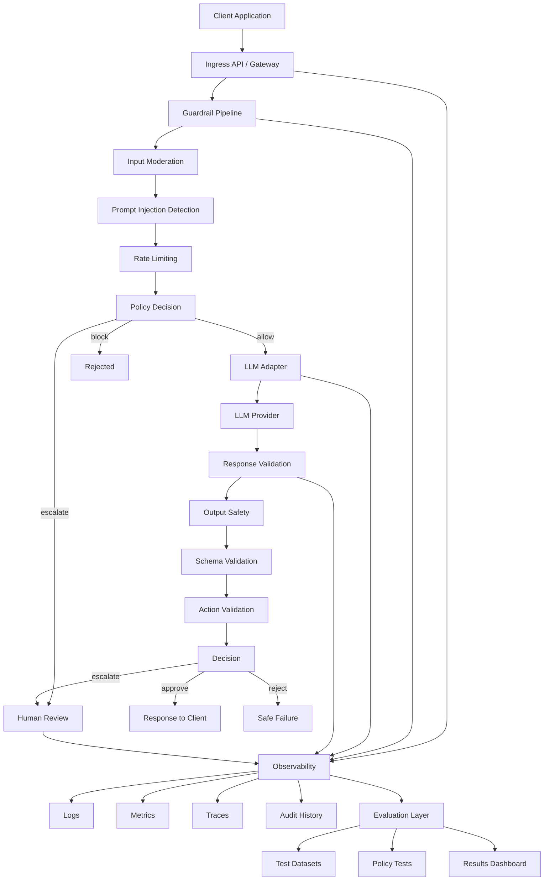
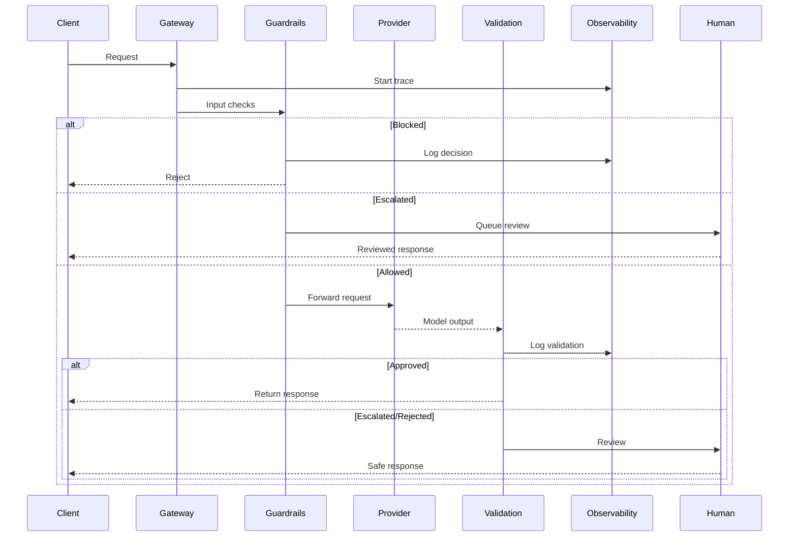

# AI Guardrails Platform Architecture

## Purpose

The AI Guardrails Platform is a reference architecture for protecting customer-facing AI assistants and agentic workflows.

It sits between client applications and LLM providers and enforces safety, policy, validation, observability, and evaluation concerns.

The system is domain-agnostic and supports:

* conversational assistants
* tool-using agents

It is designed to handle:

* adversarial prompts
* prompt injection and jailbreak attempts
* abusive usage patterns
* unsafe outputs
* sensitive or high-risk actions

---

## Architectural Goals

* Enforce policy-driven controls before LLM invocation
* Separate guardrails from business logic
* Support agent/tool workflows safely
* Validate responses before returning them
* Provide strong observability (logs, metrics, traces)
* Enable evaluation-driven iteration

---

## Non-Goals (Initial Phase)

* No production-ready implementation yet
* No full evaluation dashboard
* No real human review system
* No provider-specific optimizations

---

## Architectural Principles

### Guardrails as Middleware

All safety and policy logic lives in a structured pipeline, not scattered conditionals.

### Observable Decisions

Every decision (allow, block, escalate) should be traceable.

### Dual-Sided Validation

Validation happens both before and after the LLM call.

### Tooling is High-Risk

Tool usage must be explicitly controlled and auditable.

### Evaluation-Ready by Design

The system must support replay and regression testing.

### Observability = Safety

If you can’t see failures or decisions, you don’t have guardrails.

---

## High-Level Architecture

---

## Request Lifecycle

---

## Core Components

### Client Application

Any upstream system:

* web app
* mobile app
* internal agent

---

### Ingress API / Gateway

Handles:

* authentication (future)
* request normalization
* trace initialization

---

### Guardrail Pipeline

**Initial focus:**

* Input moderation
* Prompt injection detection
* Rate limiting
* Human escalation

**Responsibilities:**

* evaluate request
* assign severity
* decide allow/block/escalate

---

### LLM Provider Adapter

Abstracts:

* provider APIs
* retries/timeouts
* request formatting

---

### Response Validation

Validates outputs before returning:

**Initial:**

* output safety
* schema validation
* action sanity

**Future:**

* hallucination detection
* citation checks
* PII filtering

---

### Observability Layer

Includes:

* logs
* metrics
* traces
* audit trail

Also feeds:

* evaluation systems
* debugging workflows

---

### Evaluation Layer

Planned capabilities:

* regression datasets
* prompt test suites
* policy validation
* run history

This enables continuous improvement of guardrails.

---

## Guardrail Scope

### Phase 1 (Prioritized)

* Input moderation
* Prompt injection detection
* Rate limiting
* Human escalation

---

### Future Guardrails (Documented, Not Implemented)

* PII detection
* tool authorization
* grounding validation
* hallucination detection
* business-rule validation

---

## Summary

This platform demonstrates how to:

* structure guardrails as a system
* enforce policy around LLM usage
* support agent workflows safely
* capture observability and auditability
* prepare for evaluation-driven iteration

The goal is not just to call an LLM safely,
but to show how a production-grade AI middleware layer should be designed.
